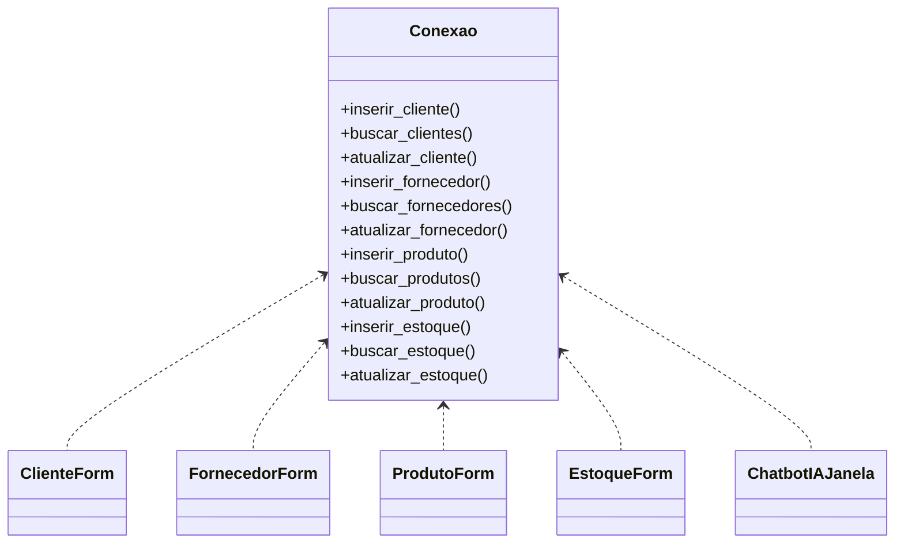

# ControleEstoque

## Descrição do Projeto

O **ControleEstoque** é um sistema desktop desenvolvido em Python para gerenciar o estoque de produtos, fornecedores, clientes e movimentações de entrada e saída. O sistema possui uma interface gráfica moderna utilizando [customtkinter](https://github.com/TomSchimansky/CustomTkinter), permitindo o cadastro, consulta e atualização de dados, além de recursos inteligentes como chatbot, gráficos e visualização de grafo de estoque.

---

## Funcionalidades

- **Cadastro, consulta e atualização** de Produtos, Fornecedores e Clientes
- **Movimentação de estoque** (entrada e saída de produtos)
- **Visualização de estoque atual**
- **Gráficos** de movimentação e estoque
- **Chatbot IA** para perguntas rápidas sobre o estoque
- **Visualização de grafo** das relações de estoque
- **Interface intuitiva** e responsiva

---

## Bibliotecas Utilizadas

- [customtkinter](https://github.com/TomSchimansky/CustomTkinter) — Interface gráfica moderna
- [tkinter](https://docs.python.org/3/library/tkinter.html) — Widgets básicos
- [sqlite3](https://docs.python.org/3/library/sqlite3.html) — Banco de dados local
- [collections](https://docs.python.org/3/library/collections.html) — Contagem e manipulação de dados
- [datetime](https://docs.python.org/3/library/datetime.html) — Datas e horários

---

## Estrutura do Banco de Dados

O sistema utiliza **SQLite** como banco de dados local. As principais tabelas são:

- **Cliente** (`Id`, `Nome`, `CPF`, `Email`, `Telefone`, `Endereco`)
- **Fornecedor** (`Id`, `RazaoSocial`, `CNPJ`, `Email`, `Telefone`, `Endereco`)
- **Produto** (`Id`, `Nome`, `CodigoBarras`, `Descricao`, `Preco`, `QuantidadeEstoque`, `FornecedorPadraoId`)
- **Estoque** (`Id`, `TipoMovimentacao`, `Quantidade`, `ProdutoId`, `FornecedorId`, `ClienteId`, `Observacao`, `DataMovimentacao`)

---

## Diagrama de Classes (Simplificado)

